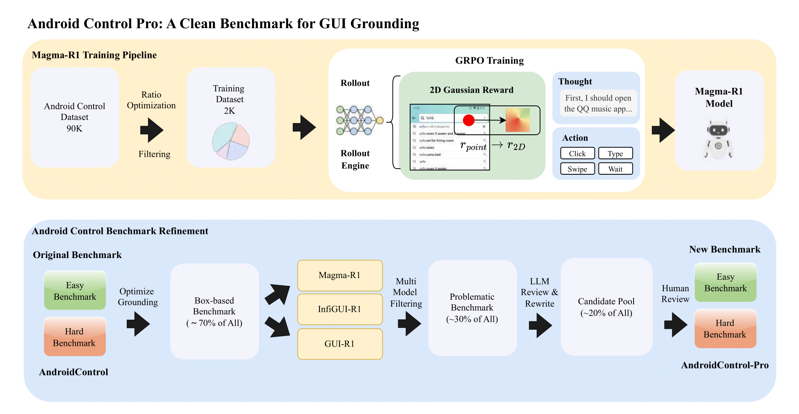

<h1 align="center">
  
  <br>
  AndroidControl-Pro: Revealing the True Potential of GUI Agents through Benchmark Purification
</h1>

<p align="center">
  <a href="YOUR_ARXIV_PAPER_LINK"></a>
  <a href="YOUR_HUGGINGFACE_DATASET_LINK"></a>
  <a href="YOUR_HUGGINGFACE_MODEL_LINK"></a>
</p>

<br>
<p align="center">
  <strong>This is the official repository for the paper <a href="YOUR_ARXIV_PAPER_LINK">AndroidControl-Pro</a>.</strong>
</p>

## 🌟 Overview

In this work, we challenge the perception that on-device GUI agents are not yet viable due to poor performance on benchmarks like AndroidControl. We identify that the benchmark itself is flawed, containing significant ambiguities and errors that underestimate agent capabilities.

To address this, we introduce **AndroidControl-Pro**, a new benchmark created through a systematic purification pipeline. On this reliable benchmark, state-of-the-art models achieve success rates approaching 80% on challenging tasks. Furthermore, we demonstrate that data quality is paramount: our new SOTA model, **Magma-R1**, trained on just 2,400 curated samples, decisively outperforms models trained on over 31k noisy data points. We release our benchmark and model to accelerate the development of the next generation of powerful, on-device virtual assistants.

<div align="center">
  
  <p><i>Overview of our integrated pipeline for Magma-R1 training and AndroidControl-Pro creation.</i></p>
</div>

## 🔥 News
- 🔥 ***`2025/10/09`*** Our paper "[AndroidControl-Pro: Revealing the True Potential of GUI Agents through Benchmark Purification](YOUR_ARXIV_PAPER_LINK)" released.

## 🚀 Updates
- ***`2025/09/30`*** The source code for `AndroidControl-Pro` and `Magma-R1` has been released.

## 📊 Results

### Table 1. Performance comparison of GUI agents on AndroidControl-Pro
*Grounding Accuracy (GA) for all models is evaluated using our proposed E_bbox. The best results are in **bold**, and the second best are <u>underlined</u>. "-" indicates results to be added.*

| Model | Pro-Easy Type (%) | Pro-Easy Grounding (%) | Pro-Easy SR (%) | Pro-Hard Type (%) | Pro-Hard Grounding (%) | Pro-Hard SR (%) |
| :--- | :---: | :---: | :---: | :---: | :---: | :---: |
| ***Proprietary Models*** | | | | | | |
| GPT-4o | 74.3 | 0.0 | 19.4 | 66.3 | 0.0 | 20.8 |
| ***Open-source Models*** | | | | | | |
| OS-Atlas-4B | **91.9** | 83.8 | 80.6 | **84.7** | 73.8 | 67.5 |
| UI-R1 | 62.2 | 93.6 | 58.9 | 54.4 | 79.3 | 43.6 |
| GUI-R1-3B | 69.5 | <u>94.7</u> | 67.1 | 63.1 | 80.3 | 54.4 |
| GUI-R1-7B | 74.9 | **95.9** | 72.7 | 66.5 | 82.6 | 57.5 |
| Infi-GUI-R1 (trained on 31k origin data) | 90.2 | 93.7 | 87.2 | 78.5 | 72.8 | <u>70.7</u> |
| ***Ours*** | | | | | | |
| Magma-R1 (trained on 400 magma data) | <u>91.3</u> | 93.7 | <u>87.7</u> | 79.2 | <u>82.7</u> | 70.6 |
| Magma-R1 (trained on 2400 magma data) | <u>91.3</u> | 94.2 | **88.0** | <u>84.2</u> | **84.8** | **75.3** |

### Table 2. Ablation analysis of the benchmark purification process on the Hard subset.
*SR Impr. (G) shows the SR gain from Origin-Bench to AndroidControl-Pro-G. SR Impr. (T) shows the SR gain from AndroidControl-Pro-G to the final AndroidControl-Pro. Best results are in **bold**, second best are <u>underlined</u>.*

| Model | Origin Type (%) | Origin Grounding (%) | Origin SR (%) | Pro-G Type (%) | Pro-G Grounding (%) | Pro-G SR (%) | Pro-G SR Impr. (G) | Pro Type (%) | Pro Grounding (%) | Pro SR (%) | Pro SR Impr. (T) |
| :--- | :---: | :---: | :---: | :---: | :---: | :---: | :---: | :---: | :---: | :---: | :---: |
| GUI-R1-3B | 57.2 | 59.0 | 41.5 | 59.3 | 74.0 | 49.4 | +7.9 | 63.1 | 80.3 | 54.4 | +5.0 |
| GUI-R1-7B | 62.5 | 65.1 | 46.3 | 63.3 | 76.9 | 53.2 | +6.9 | 66.5 | 82.6 | 57.5 | +4.3 |
| Infi-GUI-R1 | 77.0 | 57.0 | 59.0 | 77.7 | 69.5 | 67.6 | +8.6 | 78.5 | 72.8 | 70.7 | +3.1 |
| Magma-R1 (400 Task) | 73.3 | 55.9 | 51.3 | 77.2 | 74.3 | 64.3 | **+13.0** | 79.2 | 82.7 | 70.6 | +6.3 |
| Magma-R1 (2400 Task) | **78.2** | **58.2** | **57.6** | **80.0** | **77.1** | **69.1** | <u>+11.5</u> | **84.2** | **84.8** | **75.3** | **+6.2** |

## 🚀 Setup & Installation

1.  **Clone the repository:**
    ```bash
    git clone https://github.com/YourUsername/YourRepoName.git
    cd YourRepoName
    ```

2.  **Install dependencies:**
    We recommend using a virtual environment (e.g., conda or venv).
    ```bash
    pip install -r requirement.py
    ```

## 🧪 Evaluation

To reproduce the results on `AndroidControl-Pro`:

1.  **Download the benchmark data:**
    Download the processed test set from [Hugging Face](YOUR_HUGGINGFACE_DATASET_LINK) and place it in the `benchmark_resource/` directory. The directory should contain the following files:
    - `android_control_high_bbox.json`
    - `android_control_high_point.json`
    - `android_control_low_bbox.json`
    - `android_control_low_point.json`
    - `android_control_high_task-improved.json`

2.  **Download the model:**
    Download the `Magma-R1` model weights from [Hugging Face](YOUR_HUGGINGFACE_MODEL_LINK) and place them in your desired location.

3.  **Run the evaluation script:**
    Execute the following command, making sure to update the paths to your model and the benchmark image directory.
    ```bash
    python eval/evaluate_actions_androidControl_vllm.py \
      --model_path /path/to/your/Magma-R1-model \
      --save_name Your_Results.xlsx \
      --image_dir /path/to/your/benchmark_images_directory
    ```

## 📚 Citation Information

If you find this work useful, a citation to the following paper would be appreciated:

```bibtex
@article{yourname2025androidcontrolpro,
  title={AndroidControl-Pro: Revealing the True Potential of GUI Agents through Benchmark Purification},
  author={Your Name and Your Co-authors},
  journal={arXiv preprint arXiv:XXXX.XXXXX},
  year={2025}
}
```
